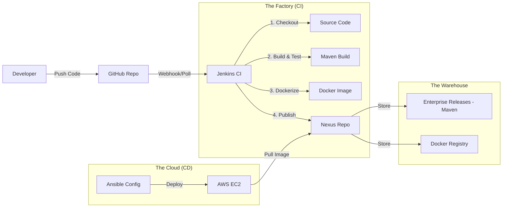
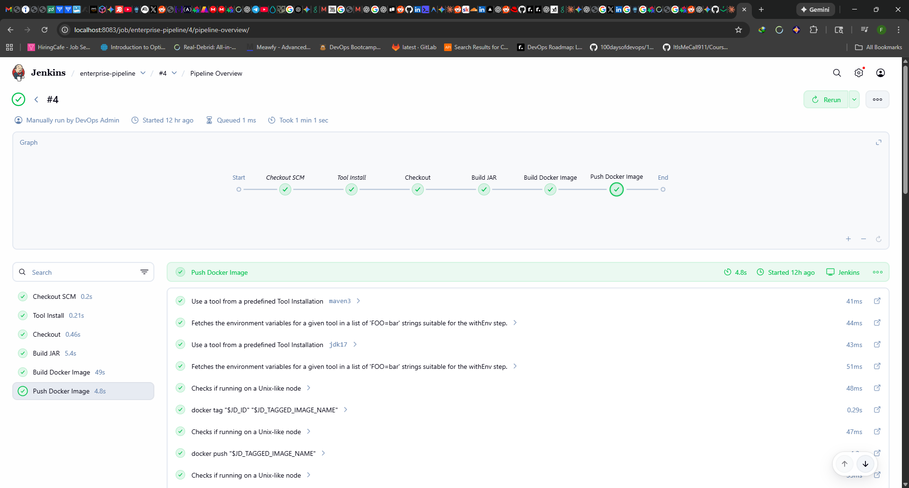
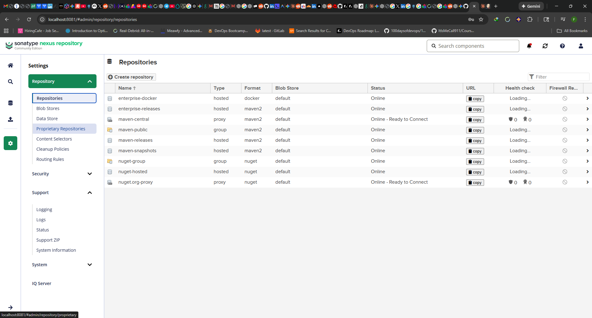

# 🚀 Enterprise DevOps Reference Implementation

[](https://github.com/FarizDemiri/enterprise-devops-bootcamp)
[](PROGRESS.md)

> **A Production-Grade CI/CD Pipeline Built from First Principles**  
> *Not a tutorial copy-paste — every decision is deliberate and documented.*

---

## 🎯 What This Project Demonstrates

This isn't a "Hello World" deployment. This repository simulates a **real enterprise environment** where:

- Code is **built and tested** automatically on every commit
- Artifacts are **versioned and stored** in a governed repository
- Deployments are **reproducible and auditable**
- Infrastructure is **code, not clicks**

**The goal**: Understand the *"Why"* behind every tool, not just the *"How"*.

---

## 📚 Documentation

| Document | Description |
|----------|-------------|
| 📖 [**The DevOps Story**](docs/DEVOPS-STORY.md) | Plain-language explanation of every concept (no jargon) |
| 📊 [**Progress Tracker**](PROGRESS.md) | Current status, completion checklist, and technical debt |

---

## 🏗️ Architecture

The pipeline follows a **"Build Once, Deploy Anywhere"** philosophy using immutable Docker containers.



### The Flow (Plain English)

1. **I push code** → GitHub receives it
2. **Jenkins wakes up** → Pulls the code, runs tests, builds a JAR
3. **Docker packages it** → Creates an identical "shipping container" every time
4. **Nexus stores it** → Like a warehouse with version tracking
5. **Ansible deploys it** → Sends the container to AWS and starts it

---

## 🛠️ Technology Stack

| Component | Technology | Why I Chose It |
|-----------|------------|----------------|
| **Application** | Java 17, Spring Boot | Enterprise standard. Type safety, mature testing (JUnit), built-in observability (`/actuator`). |
| **Build Tool** | Maven | Industry standard for Java. Declarative dependency management, reproducible builds. |
| **CI Orchestrator** | Jenkins (LTS) | Unlike GitHub Actions, Jenkins teaches you *how CI actually works* — agents, executors, plugins. |
| **Artifact Storage** | Sonatype Nexus 3 | "Single Source of Truth" for artifacts. Proxies Maven Central, hosts private releases, Docker registry. |
| **Containerization** | Docker | Eliminates "works on my machine". Same bytes in dev = same bytes in prod. |
| **Cloud** | AWS (EC2) | Industry leader. Learning AWS transfers to 70%+ of job postings. |
| **IaC** | Terraform *(planned)* | Declarative infrastructure. Version-controlled, auditable, reproducible. |
| **Config Management** | Ansible *(planned)* | Agentless push model. Perfect for configuring immutable infrastructure. |

---

## 💡 Key Learnings & Challenges

Real learning comes from debugging. Here's what broke and what I learned:

| Challenge | What Happened | How I Fixed It | The Lesson |
|-----------|---------------|----------------|------------|
| **Security Groups** | App deployed but browser showed "Connection Timeout" | Added port 8080 to AWS inbound rules | Cloud networking is "deny by default" — the bouncer needs a guest list |
| **Docker-in-Docker** | Jenkins couldn't build Docker images | Mounted host's `/var/run/docker.sock` | Trade-off: less isolation, but simpler and more reliable |
| **Nexus Authentication** | `401 Unauthorized` when pushing artifacts | Created Jenkins credentials, updated `pom.xml` | Never hardcode secrets. Use credential providers. |
| **Maven Test Failures** | Pipeline kept failing at test stage | Read the test output, fixed null pointer in setup | CI forces you to write *actually working* tests |

---

## 📊 Current Progress

```
[██████████░░░░░░░░░░] 45% Complete
```

| Milestone | Status | Description |
|-----------|--------|-------------|
| ✅ M1 | Complete | Repository scaffold, Git workflow |
| ✅ M2 | Complete | Spring Boot app, Maven build, unit tests |
| ✅ M3 | Complete | Docker multi-stage build, Docker Compose |
| ✅ M4 | Complete | AWS EC2 deployment, Security Groups |
| ✅ M5 | Complete | Nexus artifact repository (Maven + Docker) |
| 🔄 M6 | In Progress | Jenkins CI/CD pipeline |
| ⬚ M7 | Planned | Kubernetes (Minikube → EKS) |
| ⬚ M8-14 | Planned | Terraform, Ansible, Monitoring, GitOps |

**[→ View Full Progress Tracker](PROGRESS.md)**

---

## 📸 Screenshots

<details>
<summary>Click to expand screenshots</summary>

### Jenkins Pipeline

*Automated build → test → dockerize → push flow*

### Nexus Repository

*Maven releases and Docker images stored centrally*

### Application Health Check

*Spring Actuator endpoint confirming app is alive*

</details>

---

## 🚦 How to Run Locally

### Prerequisites
- Docker Desktop (or Docker Engine + Compose)
- Git
- Java 17+ (for local development)
- Maven 3.8+

### Quick Start

```bash
# Clone the repository
git clone https://github.com/FarizDemiri/enterprise-devops-bootcamp.git
cd enterprise-devops-bootcamp

# Start the infrastructure
docker-compose -f nexus/docker-compose.yml up -d    # The Warehouse
docker-compose -f jenkins/docker-compose.yml up -d  # The Factory

# Access the consoles
# Jenkins: http://localhost:8083
# Nexus:   http://localhost:8081

# Run the app standalone (for testing)
cd app
mvn spring-boot:run
# App: http://localhost:8080/actuator/health
```

### Default Credentials (Lab Only!)

| Service | Username | Password |
|---------|----------|----------|
| Jenkins | admin | (see initial setup) |
| Nexus | admin | admin123 |

⚠️ *These are intentionally simple for the learning environment. See [Technical Debt](PROGRESS.md#-technical-debt-registry) for production considerations.*

---

## 🔮 Roadmap

| Phase | Milestone | Tools | Status |
|-------|-----------|-------|--------|
| **Foundation** | App + Build + Docker | Java, Maven, Docker | ✅ Complete |
| **CI/CD** | Jenkins Pipeline | Jenkins, Nexus | 🔄 In Progress |
| **Orchestration** | Kubernetes | Minikube, EKS | ⬚ Next |
| **Infrastructure** | IaC | Terraform, Ansible | ⬚ Planned |
| **Observability** | Monitoring | Prometheus, Grafana | ⬚ Planned |
| **Advanced** | GitOps + Security | Argo CD, Trivy | ⬚ Planned |

---

## 🤔 Why This Project?

I built this to prove I understand DevOps **fundamentals**, not just tool syntax.

Anyone can copy a `Jenkinsfile` from StackOverflow. The difference is:
- **Knowing *why* Jenkins uses agents** (distributed builds, isolation)
- **Knowing *why* we need Nexus** (governance, caching, single source of truth)
- **Knowing *why* Docker matters** (immutability, reproducibility)

This project is my answer to: *"Explain your CI/CD pipeline and justify every component."*

---

## 📬 Let's Connect

I'm currently learning DevOps and seeking opportunities in **DevOps / Platform Engineering / SRE**.

- **LinkedIn**: [linkedin.com/in/FarizDemiri](https://linkedin.com/in/FarizDemiri)
- **GitHub**: [github.com/FarizDemiri](https://github.com/FarizDemiri)
- **Email**: Farizdemiri@gmail.com

---

<p align="center">
  <i>Built with curiosity, debugged with patience, documented with care.</i>
</p>
