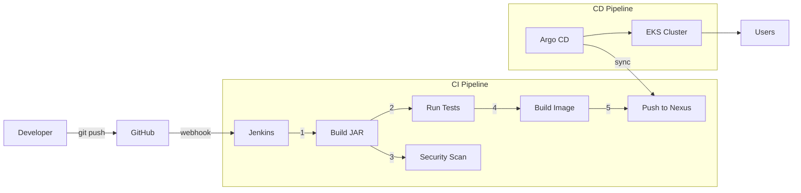

# Enterprise DevOps Pipeline

> A production-grade CI/CD implementation demonstrating the complete software supply chain—from commit to Kubernetes deployment.

[](https://github.com/FarizDemiri/enterprise-devops-bootcamp)
[](PROGRESS.md)
[](terraform/)

---

## The Problem

Most teams struggle with three things:

1. **"It works on my machine"** — Code that runs locally breaks in production because environments differ.
2. **"Who deployed what?"** — No audit trail of which version is running where, making rollbacks a nightmare.
3. **"Manual deployments"** — SSH into servers, pull images, restart containers, hope nothing breaks. This doesn't scale.

These aren't tool problems. They're **process problems** that tools can solve—if you understand why each tool exists.

---

## The Solution

An automated pipeline where:

- Every commit triggers a build (no manual intervention)
- Every build produces a versioned, immutable artifact (Docker image)
- Every artifact is stored in a governed registry (Nexus)
- Every deployment pulls from that registry (Kubernetes)

**The result**: I can tell you exactly which commit is running in production, roll back in seconds, and deploy 50 times a day without SSH.

---

## Architecture

> 🏛️ **[See the Full System Architecture Diagram](docs/ARCHITECTURE.md)**



### The Flow

| Step | What Happens | Tool |
|------|--------------|------|
| 1 | Developer pushes code | Git |
| 2 | Webhook notifies CI server | Smee → Jenkins |
| 3 | Code is compiled and tested | Maven |
| 4 | Image is scanned for vulnerabilities | Trivy |
| 5 | Application is packaged into container | Docker |
| 6 | Image is pushed with semantic version | Nexus |
| 7 | Argo CD detects change | GitOps |
| 8 | Kubernetes pulls and deploys | AWS EKS |

---

## Tech Stack

| Layer | Tool | Why This Tool |
|-------|------|---------------|
| **Application** | Java 17, Spring Boot | Enterprise standard. Built-in health endpoints (`/actuator`), mature testing ecosystem. |
| **Build** | Maven | Reproducible builds. Dependency resolution. Industry standard for Java. |
| **CI Server** | Jenkins | Teaches how CI actually works—agents, executors, pipelines—not just YAML. |
| **Artifacts** | Sonatype Nexus | Single source of truth. Hosts both Maven JARs and Docker images. Audit trail. |
| **Security** | Trivy | Vulnerability scanner ("Shift Left"). Blocks builds if Critical CVEs are found. |
| **Containers** | Docker | Immutable deployments. Eliminates environment drift. |
| **Orchestration** | Kubernetes (EKS) | Self-healing, declarative, industry standard. Moved from Minikube (Toy) to EKS (Production). |
| **Infrastructure** | Terraform | Infrastructure as Code. Defines the VPC, Subnets, and Cluster in `.tf` files. |
| **Packaging** | Helm | The "App Store" for Kubernetes. Templates our YAMLs for multi-environment support. |
| **CD** | Argo CD | GitOps controller. Ensures the cluster state always matches the Git repo. |
| **Observability** | Prometheus/Grafana | The "CCTV". Metrics collection and visualization. "Flying blind" is over. |
| **Webhooks** | Smee.io | Tunnels GitHub webhooks to localhost for instant CI triggers. |

---

## What I Built (and What Broke)

Real learning comes from debugging. Here's what actually happened:

| Challenge | Symptom | Root Cause | Fix | Lesson |
|-----------|---------|------------|-----|--------|
| **Security Groups** | Browser timeout after deploy | AWS blocks all ports by default | Added inbound rule for 8080 | Cloud is "deny by default" |
| **Docker-in-Docker** | Jenkins can't build images | No Docker daemon in container | Mounted `/var/run/docker.sock` | Trade isolation for simplicity |
| **Nexus 401** | Push rejected | Missing credentials | Configured `settings.xml` + Jenkins credentials | Never hardcode secrets |
| **Infinite loops** | Pipeline triggers itself | Version commit triggers webhook | Added `[skip ci]` to commit message | CI commits need escape hatches |
| **Air gap** | EKS can't pull from localhost Nexus | Localhost doesn't exist in cloud | Pushed to Docker Hub as intermediary | Local registries need exposure |
| **Version Hell** | Terraform Provider Conflicts | v6.0 broke v5.0 code | Pinned versions in `main.tf` | Lock your dependencies |
| **Blindness** | App crashing silently | No logs/metrics | Installed Prometheus Stack | You can't fix what you can't see |
| **GitOps Sync** | Argo CD confused | Manual Helm deploy conflicted | Deleted manual helm, let Argo take over | Don't mix CI-Ops and GitOps |
| **Vulnerabilities** | Trivy blocked build | Old Tomcat version | Overrode `pom.xml` dependency version | Frameworks lag behind security patches |

---

## Project Status

```
[████████████████████] 100% Complete
```

| Milestone | Status | Description |
|-----------|--------|-------------|
| ✅ M1-2 | Complete | Spring Boot app, Maven build, unit tests |
| ✅ M3 | Complete | Multi-stage Dockerfile, Docker Compose |
| ✅ M4 | Complete | AWS EC2 manual deployment |
| ✅ M5 | Complete | Nexus artifact repository |
| ✅ M6 | Complete | Jenkins pipeline (multibranch, shared library, webhooks, versioning) |
| ✅ M7 | Complete | Kubernetes on Minikube |
| ✅ M8 | Complete | Kubernetes on AWS EKS |
| ✅ M9 | Complete | Infrastructure as Code (Terraform) |
| ✅ M10 | Complete | Helm Packaging (Charts, Values, Templates) |
| ✅ M11 | Complete | Observability (Prometheus & Grafana) |
| ✅ M12 | Complete | GitOps (Argo CD) |
| ✅ M13 | Complete | Security Scanning (Trivy) |
| ✅ M14 | Complete | Final Architecture Documentation |

→ [Full checklist in PROGRESS.md](PROGRESS.md)

---

## Run It Yourself

### Prerequisites

- Docker Desktop
- Java 17
- Maven 3.8+
- (Optional) Minikube for Kubernetes

### Quick Start: CI Infrastructure

```bash
# Clone
git clone https://github.com/FarizDemiri/enterprise-devops-bootcamp.git
cd enterprise-devops-bootcamp

# Start Jenkins + Nexus
docker-compose -f jenkins/docker-compose.yml up -d
docker-compose -f nexus/docker-compose.yml up -d

# Access
# Jenkins: http://localhost:8083
# Nexus:   http://localhost:8081 (admin / admin123)
```

### Quick Start: The Application

```bash
cd app
mvn spring-boot:run
# http://localhost:8080/actuator/health
```

### Quick Start: Kubernetes (EKS + Helm)

```bash
# 1. Provision Infrastructure
cd terraform && terraform apply

# 2. Deploy Monitoring Stack
helm install my-prometheus prometheus-community/kube-prometheus-stack --namespace monitoring

# 3. Deploy Application
helm install my-app ./charts/enterprise-app
```

### Full Setup Guide

For complete setup including Jenkins credentials, Nexus repositories, and webhook configuration, see [docs/SETUP.md](docs/SETUP.md).

---

## Documentation

| Document | Purpose |
|----------|---------|
| [PROGRESS.md](PROGRESS.md) | Detailed checklist, technical debt tracking |
| [docs/LEARNING_JOURNEY.md](docs/LEARNING_JOURNEY.md) | Plain-language explanations of every concept |
| docs/SETUP.md | Complete setup instructions *(coming soon)* |

---

## Technical Debt

I'm tracking these intentional shortcuts:

| Severity | Item | Why | Remediation |
|----------|------|-----|-------------|
| 🔴 High | Plaintext passwords | Lab speed | HashiCorp Vault |
| 🟠 Med | Root user in containers | Docker socket permissions | Dedicated jenkins user |
| 🟠 Med | HTTP only | No certs on localhost | Nginx + Let's Encrypt |
| 🟡 Low | No Nexus backup | Ephemeral lab | S3 blob store |

---

## What's Next (Extensions)

The core bootcamp is done, but the journey never ends.

- [ ] **Cost Optimization**: Use Spot Instances in Terraform.
- [ ] **Secret Management**: Integrate HashiCorp Vault.
- [ ] **Service Mesh**: Install Istio for mTLS and traffic splitting.
- [ ] **Chaos Engineering**: Use LitmusChaos to break pods randomly.

---

## Connect

**Fariz Demiri** — Learning DevOps by building, not watching.

- GitHub: [github.com/FarizDemiri](https://github.com/FarizDemiri)
- LinkedIn: [linkedin.com/in/FarizDemiri](https://linkedin.com/in/FarizDemiri)
- Email: <Farizdemiri@gmail.com>

---

<p align="center"><i>Built with curiosity, debugged with patience, documented with care.</i></p>
