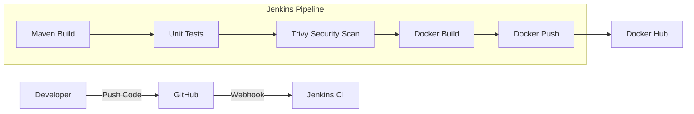
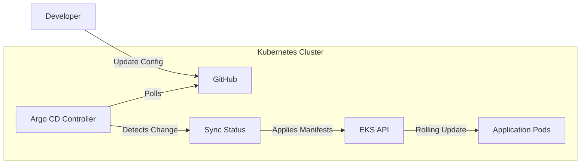
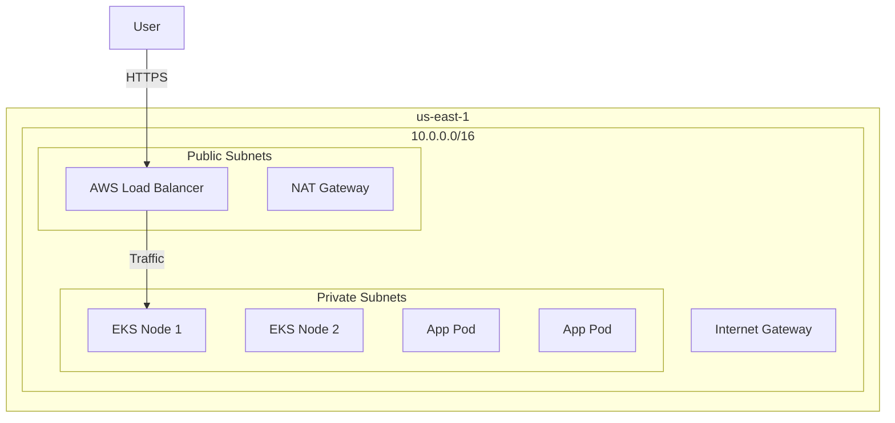

# 🏛️ Enterprise DevOps Architecture

## 1. The "Why"

This platform is designed to emulate a **Real-World Banking Environment**.
It moves away from "Toy" setups (Minikube, Shell Scripts) to "Enterprise" standards (EKS, Terraform, GitOps).

## 2. The Components (The Stack)

| Layer | Tool | Purpose |
|-------|------|---------|
| **Infrastructure** | **Terraform** | Defines the AWS VPC, EKS Cluster, and Networking as Code. |
| **Orchestration** | **AWS EKS (K8s)** | Manages the application containers in a production-grade cluster. |
| **Packaging** | **Helm** | Templates the Kubernetes manifests (Deployments, Services) for reusability. |
| **CI (Build)** | **Jenkins** | Compiles Java, Runs Tests, Builds Docker Images. |
| **Artifacts** | **Nexus / DockerHub** | Stores the compiled JARs and Container Images. |
| **Security** | **Trivy** | Scans images for CVEs before they leave the build pipeline. |
| **CD (Deploy)** | **Argo CD** | Syncs the Git state to the Cluster (GitOps). |
| **Observability** | **Prometheus/Grafana** | Monitors metrics and visualized cluster health. |

---

## 3. The Continuous Integration (CI) Pipeline

**Trigger**: Developer pushes code to `main`.

---

## 4. The Continuous Delivery (CD) Pipeline (GitOps)

**Trigger**: Developer updates `values.yaml` (e.g., Image Tag).

---

## 5. The Infrastructure (AWS)

**Managed by**: Terraform.

